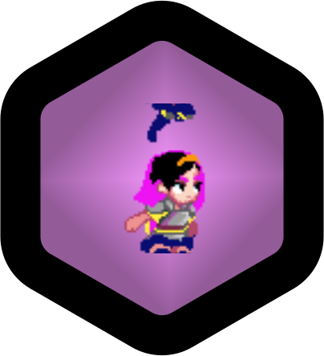

# 
Shrula odyessey

### My attempt at learning godot and following through the [Godot 2D platformer tutorial from Brackeys](https://www.youtube.com/watch?v=LOhfqjmasi0)

#### All sourced assets:
- [Brackeys' Platformer Bundle](https://brackeysgames.itch.io/brackeys-platformer-bundle)
- [Girl Knight Character Asset](https://jumpbutton.itch.io/girlknightasset)
- [joystick plugin for godot](https://godotengine.org/asset-library/asset/1787)

#### unique additions so far:
- Custom script additions:
	- A double jump mechanic for the 2d sprite
	- Updated behaviour for the enemy sprite
	- Added joystick support for android and web builds of mobile
- Assets front:
	- A custom svg logo using figma
	- Edited the colors of the 
	
#### possible genre:
- 

#### Upcoming todos:
- Optimising the export builds
- exploring the ipa builds
- worldbuilding 2.0
- mechanics 2.0 (expand on the double jump)
- indegnous assets 
